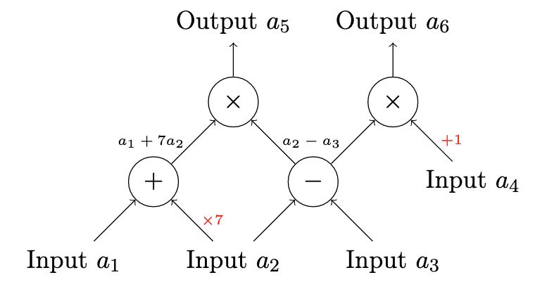

# ZK programming using Arkworks

## Arithmetic circuits

In the process of generating ZK-SNARKs for arbitrary computation there is one key step, called `arithmetization`. This is where this computation, written in some high level language like Aleo instructions, is turned into an `arithmetic circuit`, a graph where each node is an operation (addition, multiplication, etc) and each edge/arrow is some input or output to/from that gate. Below is an example:



Here, the circuit has four inputs $a_1$, $a_2$, $a_3$, and $a_4$ and two outputs $a_5$ and $a_6$, that encode the following computation:

$$
a_5 = (a_1 + 7a_2) * (a_2 - a_3) \\
a_6 = (a_2 - a_3) * (a_4 + 1)
$$

## R1CS

Arithmetic circuits can be expressed in a different but equivalent way, called a `Rank One Constraint System`. We're not going to go into much detail about it, but the high level idea is an `R1CS` is an equation of the form

$$
(\sum a_k x_k) * (\sum b_k x_k) = (\sum c_k x_k)
$$

where the $x_k$ can roughly be thought of as the inputs to the circuit. More compactly, this can be written as

$$
Ax * Bx = Cx
$$

for some appropriate `A`, `B` and `C`.

Arkworks circuits are expressed in `R1CS` form, so a circuit is just referred to as a `constraint system` or just a set of `constraints`.

## Arkworks circuit API

Arkworks exposes an API to create circuits through the `ark_r1cs_std` and `ark_relations` packages. In Arkworks, a circuit is any struct that implements the `ConstraintSynthetizer` trait:

```rust
pub trait ConstraintSynthesizer<F: Field> {
    /// Drives generation of new constraints inside `cs`.
    fn generate_constraints(self, cs: ConstraintSystemRef<F>) -> crate::r1cs::Result<()>;
}
```

Because all calculations inside a circuit are done on a finite field, this trait is generic over it.

Implementing `ConstraintSynthetizer` amounts to implementing the function `generate_constraints`. To give an idea of how this works, let's go through an example.

### Simple circuit

We are going to write a circuit that just takes two numbers as input and checks if they are equal. We define a struct called `TestCircuit`

```rust
#[derive(Clone)]
pub struct TestCircuit {
    /// Private input
    pub a: u8,
    /// Private input
    pub b: u8,
}
```

As the comments suggest, circuit inputs can be either `public` or `private`. Private inputs are hidden to the verifier, i.e., after constructing a proof, the verifier does not have access to them; the proof itself proves that we know a value for it that satisfies the circuit without revealing it.

Now we need to write the constraints for this circuit:

```rust
use ark_r1cs_std::prelude::*;
use ark_relations::r1cs::{ConstraintSynthesizer, ConstraintSystemRef, SynthesisError};

impl ConstraintSynthesizer<ark_ed_on_bls12_381::Fq> for TestCircuit {
    fn generate_constraints(
        self,
        cs: ConstraintSystemRef<ark_ed_on_bls12_381::Fq>,
    ) -> Result<(), SynthesisError> {
        let a = UInt8::new_witness(ark_relations::ns!(cs, "a"), || Ok(self.a))?;

        let b = UInt8::new_witness(ark_relations::ns!(cs, "b"), || Ok(self.b))?;

        a.enforce_equal(&b)?;

        Ok(())
    }
}
```

For the generic `F` type, we are using a finite field defined in the `ark_ed_on_bls12_381` crate. This is a crate implementing the `bls 12-381` elliptic curve that we'll use later on for proving.

To make our lives easier for now, we are using what Arkworks calls a `Gadget`. These are pre-generated circuits that we can use as building blocks for coding our constraints. You can sort of think of them as a standard library for circuits. In our example, we are using the `UInt8` gadget, a way of defining and manipulating unsigned 8 bit integers in this context. Later on we will be showing how to do this without gadgets, defining our constraint manually.

With the `UInt8` gadget, we define two private inputs (also called `witnesses`) `a` and `b`, and then call the `enforce_equal` function between them (again, this function is provided by the gadget, we'll see below how to enforce this constraint by hand).

To instantiate a circuit and check if the constraints are satisfied for a given set of inputs, we do the following:

```rust
use ark_relations::r1cs::{ConstraintSynthesizer, ConstraintSystem};

let circuit = TestCircuit { a: 1, b: 1 };

let cs = ConstraintSystem::new_ref();
circuit.generate_constraints(cs.clone()).unwrap();

let is_satisfied = cs.is_satisfied().unwrap();
assert!(is_satisfied);
```

Doing the same with the `a` and `b` inputs being different should fail.

### Constraints without gadgets

Let's write the same `TestCircuit` as before, but without using the `UInt8` gadget. The struct definition is the same, but now the constraints are defined as follows:

```rust
impl ConstraintSynthesizer<ark_ed_on_bls12_381::Fq> for TestCircuit {
    fn generate_constraints(
        self,
        cs: ConstraintSystemRef<ark_ed_on_bls12_381::Fq>,
    ) -> Result<(), SynthesisError> {
        let a = cs.new_witness_variable(|| {
            Fq::try_from(self.a).map_err(|_| SynthesisError::AssignmentMissing)
        })?;

        let b = cs.new_witness_variable(|| {
            Fq::try_from(self.b).map_err(|_| SynthesisError::AssignmentMissing)
        })?;

        cs.enforce_constraint(lc!(), lc!(), lc!() + (ark_ed_on_bls12_381::Fq::one(), a) - (ark_ed_on_bls12_381::Fq::one(), b))?;

        Ok(())
    }
}
```

To create the two private inputs, we now use the `new_witness_variable` method for the `ConstraintSystem` we get as an argument when generating constraints. Because every calculation inside a circuit actually happens in a finite field, to create the inputs we manually cast our `a` and `b` values to be field elements. Of course, the `UInt8` gadget just does the same behind the scenes (the gadget treats a `u8` as an array of 8 booleans using the `Boolean` gadget, which in turn calls [this](https://github.com/arkworks-rs/r1cs-std/blob/master/src/bits/boolean.rs#L22) to do the conversion).

Having created our inputs, we now manually define our constraint with the `enforce_constraint` function. This expects three arguments called `a`, `b`, and `c`, which correspond to the `A`, `B`, and `C` values defined in the high-level `R1CS` equation we talked about above. Each one of them is of type `LinearCombination<F>`, which is nothing more than a `Vec<(F, Variable)>` (variable being either a constant, public/private input or another linear combination). This is just a way of encoding a sum of the form:

$$
\sum a_k x_k
$$

The $a_k$s are of type `F`, the $x_k$s are variables.

Going back to our example, we defined our constraint by passing `a`, `b`, and `c` as:

```rust
use ark_std::One;

a = lc!()
b = lc!()
c = lc!() + (ark_ed_on_bls12_381::Fq::one(), a) - (ark_ed_on_bls12_381::Fq::one(), b)
```

The macro `lc!()` is provided by Arkworks and just generates an empty linear combination, i.e., zero. For our `c`, we are substracting from variable

```rust
(ark_ed_on_bls12_381::Fq::one(), a)
```

the variable

```rust
(ark_ed_on_bls12_381::Fq::one(), b)
```

which is just a complicated way of saying `a - b` inside our finite field. Putting it all together, our constraint is

$$
0 * 0 = a - b
$$

a.k.a.

$$
a = b
$$

Note that this is not the only way of writing this constraint, in our case we could have also defined

```rust
a = (ark_ed_on_bls12_381::Fq::one(), a) - (ark_ed_on_bls12_381::Fq::one(), b)
b = (ark_ed_on_bls12_381::Fq::one(), 1)
c = lc!()
```

encoding the equation

$$
(a - b) * 1 = 0
$$

As is clear from this example, it is much easier to work with gadgets if you can, as they abstract a lot of details from the programmer.

## Proving and verifying our computation with the Marlin crate

With our circuit in hand, what we need to create a ZK-SNARK over it is a `proving system`, a way to obtain a proof that we ran the circuit with the given inputs (both public and private) and it produced the given outputs (again, both public and private). TODO: check if outputs are actually a part of the circuit/proof API or if they are a higher level thing.

Arkworks provides packages for two different proving systems: `Groth16` and `Marlin`. For the next example we'll be using `Marlin`, which Aleo uses for its blockchain.

The API for both generating and verifying proofs is incredibly simple:

```rust
use ark_marlin::{Marlin, SimpleHashFiatShamirRng};

use ark_bls12_381::{Bls12_381, Fr};
use ark_poly::univariate::DensePolynomial;
use ark_poly_commit::marlin_pc::MarlinKZG10;
use blake2::Blake2s;
use rand_chacha::ChaChaRng;
type MultiPC = MarlinKZG10<Bls12_381, DensePolynomial<Fr>>;
type FS = SimpleHashFiatShamirRng<Blake2s, ChaChaRng>;
type MarlinInst = Marlin<Fr, MultiPC, FS>;

#[test]
fn prove_and_verify() {
    let rng = &mut ark_std::test_rng();
    let universal_srs = MarlinInst::universal_setup(100, 25, 300, rng).unwrap();

    let circuit = super::TestCircuit { a: 1, b: 1 };
    let (index_pk, index_vk) = MarlinInst::index(&universal_srs, circuit.clone()).unwrap();

    let proof = MarlinInst::prove(&index_pk, circuit.clone(), rng).unwrap();

    let proof_verifies : bool = MarlinInst::verify(&index_vk, &[], &proof, rng).unwrap();
    assert!(proof_verifies);
}
```

Before going over the code, we'll cover how proofs are carried out.

In Marlin and other proving systems, generating and verifying proofs for a given circuit requires having previously sampled a `proving key` and a `verifying key`, respectively. You can think of the proving key as something that homomorphically encrypts the circuit, and the verifying key as something that allows to check whether the circuit computation is correct, without having to run it entirely or decrypt it.

The need for a proving/verifying key-pair for every circuit is an inconvenience, since in a setting like the Aleo blockchain there could be thousands of programs (which are ultimately circuits); executing or verifying any of them would require knowledge of these keys that the program's owner generated. This prompted the need for an agreed-upon, deterministic way of deriving these keys, which is the entire point of `Marlin` as a proving system.

In `Marlin`, all proving and verifying keys are deterministically derived from a so called Universal Structured Reference String (SRS), sometimes also called Common Reference String (CRS). This Universal string is generated in a `Universal Setup`, a scheme in which lots of different people contribute to the SRS. It's crucial that multiple people participate, since this process is essentially nothing more than sampling a (huge) random value, which the SRS is derived from. In a sense, the SRS is like a global public key for every circuit created over it, derived from some private key. Knowledge of this private key allows anyone to forge proofs at will, so it needs to be a secret to everyone in the system.

Back to our code, the first thing we do is sample a universal SRS for our system. In a context like Aleo, this would have already happened and the SRS would be a public value already known to us. The `universal_setup` function takes a bunch of arguments that control the maximum number of constraints and variables any circuit derived from it can have. Here we keep the values low, but in a real world scenario they would be huge.

With our SRS, we instantiate our circuit and call the `index` function, passing the `universal_srs` in addition to our circuit to derive our proving and verifying keys. The reason it's called `index` goes back to the Marlin paper, but it refers to the key sampling.

Having our keys, all it takes to produce a proof is calling `prove` passing the `proving_key`, our circuit and a source of randomness. To verify it, in addition to the `verifying_key`, our circuit and a source of randomness, we pass a list with the public inputs for the circuit. The `verify` function will return a `Result<bool>`.

## Deeper dive into Marlin

In the preceding section we swept under the rug a very important part of the code, namely these three imports:

```rust
type MultiPC = MarlinKZG10<Bls12_381, DensePolynomial<Fr>>;
type FS = SimpleHashFiatShamirRng<Blake2s, ChaChaRng>;
type MarlinInst = Marlin<Fr, MultiPC, FS>;
```

The `Marlin` struct used for proving and verifying has three generic types which have to be provided when instantiating it:

```rust
pub struct Marlin<F: PrimeField, PC: PolynomialCommitment<F, DensePolynomial<F>>, FS: FiatShamirRng>
```

Let's explain what they are. At a high level, `Marlin` is composed of three distinct parts:

- A Polynomial Interactive Oracle Proof (PIOP), a way of constructing a polynomial for our proof of the computation (i.e. our circuit/R1CS) and a protocol for interactively verifying it.
- A Polynomial commitment scheme, a method for commiting to the polynomial above without revealing it to the verifier, while allowing them to prod into it a bit to convince them that it is correct.
- A source of true randomness required by the `Fiat-Shamir heuristic`, which is a way of turning the interactive verification protocol defined by the PIOP into a non-interactive one. This is really important, as without it verification would require live communication between prover and verifier.

Of these three things, the `Marlin` struct allows us to choose different implementations of the last two. The PIOP is fixed, but the choice of polynomial commitment scheme and source of randomness for `Fiat-Shamir` can be chosen; that's what the `PC` and `FS` generic types are for. The `F` one is simply the choice of finite field, required by the `PolynomialCommitment` scheme choice, which uses elliptic curve cryptography underneath.

For our example, we are using polynomial commitment and Fiat-Shamir `rng` implementations given by Arkworks. `MarlinKZG10` is a version of the popular `KZG` commitment scheme; other common PC choices are `FRI` or `DARK`.

## Useful References

- [Arkworks R1CS tutorial](https://github.com/arkworks-rs/r1cs-tutorial)
- [ZK Gadgets using Arkworks](https://github.com/webb-tools/zero-knowledge-gadgets)
- [Noir's Arkworks Backend](https://github.com/noir-lang/arkworks_backend)
